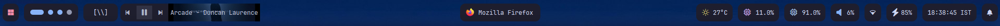

<p align="center"></p>
<h2 align="center">Yasb - Yet Another Status Bar</h2>
<p align="center">
  A highly configurable cross-platform (Windows) status bar written in Python.
  <br><br>
  <a href="https://opensource.org/licenses/MIT"></a>
  <a href="https://github.com/ashwinjadhav818/yasb"></a>
  <a href="https://github.com/ashwinjadhav818/yasb/issues"></a>
</p>

### What is it?
**Yasb** (Yet Another Status Bar) is a highly configurable status bar written in Python using the Qt6 GUI Framework. The current goal of yasb is to bring a [polybar](https://github.com/polybar/polybar)/[waybar](https://github.com/Alexays/Waybar)-style status bar to the Windows platform. However, as yasb is written in Python + Qt6, it is cross-platform capable. With some minor adjustments and OS-specific widgets, yasb can also be configured to run on both Linux and Mac OSX.

### What can it look like?
Although yasb comes with **default stylesheet and configuration files**, the user is given complete control over how their status bar is structured and how it will look.

The config file allows for extensive configuration of one or more taskbars, whereas, the stylesheet used by yasb allows for complete control over how the bar and its nested widgets should look. Change everything from font and colours to rounded corners, padding and opacity. 

For an example of the default bar configuration, see the image below:


## Widgets

- **Power Menu**: Access various power options including lock, sleep, shutdown, restart, and hibernate.
- **Active Window**: Displays the title and icon of the currently active window.
- **Flashing Windows**: Indicates windows that are flashing to draw attention.
- **Battery**: Shows the percentage of battery remaining, charging status, and time remaining.
- **Clock**: Displays the current time, with options for different time zones and date formats.
- **CPU**: Displays CPU usage with a histogram view available.
- **Memory**: Shows the current memory usage.
- **WiFi**: Displays the current WiFi signal strength and network name.
- **Disk**: Shows disk space usage.
- **Volume**: Displays the volume percentage.
- **Media Player**: Shows the currently playing media with its thumbnail and controls.
- **Traffic**: Displays the download and upload speeds.
- **Weather**: Shows current weather statistics.
- **Komorebi Workspaces**: Integrates with [Komorebi](https://github.com/lgug2z/komorebi) to show workspace information.
- **Komorebi Active Layout**: Displays the current layout in use by Komorebi.

### How do you run it?
- Install [Python 3.12](https://www.python.org/doc/versions/)
- Install required Python Modules:
  - pip install -r [requirements.txt](requirements.txt)
- Create the directory `C:/Users/{username}/.config/yasb/` and copy [styles.css](src/styles.css) and [config.yaml](src/config.yaml) into folder.
  - Configure [styles.css](src/styles.css) and [config.yaml](src/config.yaml) to your liking.
- Start the application:
  - run `python src/main.py` in your terminal (or create a startup shortcut)

### What do I do if I've spotted a bug?
**This project is still in early development... If you encounter any bugs, please submit an [issue](https://github.com/ashwinjadhav818/yasb/issues) :bug:**

*Note: Please include a log file along with steps to reproduce when submitting a bug report, it helps!*

### How do you configure it?
All taskbars can be configured in a user-defined YAML config file [config.yaml](src/config.yaml) located in either of the following directories:
- `C:/Users/{username}/.config/yasb/config.yaml`
- `/path/to/yasb/src/config.yaml`

All taskbars can also be styled using a configurable stylesheet [styles.css](src/styles.css):
- `C:/Users/{username}/.config/yasb/styles.css`
- `/path/to/yasb/src/styles.css`

NOTE: If either configuration file is not present in the user's `$HOME/.config/yasb` directory (or if they contain errors), the default config and stylesheet will be loaded instead. You may also be prompted with a popup error dialog showing which lines of code contain linting errors.

## Troubleshooting

#### Why aren't icons being displayed correctly in my taskbar?
By default, yasb uses the JetBrainsMono [Nerd font](https://nerdfonts.com). If this is not installed on your system, this is likely the reason why icons are not appearing correctly in your taskbar.

If you would like to use a different icon font, simply change the wildcard font-family CSS rule in the stylesheet file to your prefered icon font:
```css
* {
    font-family: "JetBrainsMono NFP";
    font-size: 12px;
    ...
}
```

#### Why is the Komorebi Workspaces widget not working?
The Komorebi Workspace widget bundled with Yasb requires that you are running [komorebi v0.18.0](https://github.com/LGUG2Z/komorebi/releases/tag/v0.1.8) or above. This is because previous komorebi versions do not support socket-based communication with external applications via Windows Named Pipes.
If you are running an older version of komorebi, yasb will not be able to query komorebi for workspace information.

**Note**: Yasb executes komorebic.exe commands directly via the [subprocess](https://docs.python.org/3/library/subprocess.html) module. For this to work, you MUST have `komoreb.exe` and `komorebic.exe` [added to your system PATH](https://medium.com/@kevinmarkvi/how-to-add-executables-to-your-path-in-windows-5ffa4ce61a53). 


## Contributions
Contributions to yasb are more than welcome. This project was started as an experiment and has blossomed into something I use every day. If you find good use out of this software but believe there are areas for improvement (of which there are likely many), please feel free to submit a Pull Request.

#### Development Environment
All you will need to get started is Python 3.12 or above.

#### Linting
The project is linted using [pylama](https://github.com/klen/pylama):
```
pip install pylama
python -m pylama
# or just  run 'pylama'
```
- The linting tool is configured in [pylama.ini](pylama.ini)
- If you choose to contribute, **please lint your code beforehand.**

#### Commit Formatting and Pull Requests
- Commit messages should ideally follow the [Conventional Commits](https://www.conventionalcommits.org/en/v1.0.0/) specification.
- Pull Requests should be submitted [here](https://github.com/ashwinjadhav818/yasb/pulls)

## Acknowledgments
This project is the fork of the original repository - [Yasb](https://github.com/da-rth/yasb)
I would like to express my sincere gratitude towards the original creator/owner of the project [Daniel A](https://github.com/da-rth) 

## Other similar projects
- [Zebar](https://github.com/glzr-io/zebar) - Status bar made in Tauri by the developer of [GlazeWM](https://github.com/glzr-io/glazewm)
- [Amn's Yasb](https://github.com/amnweb/yasb) - Also a fork of the original yasb project but is been constantly been worked on.